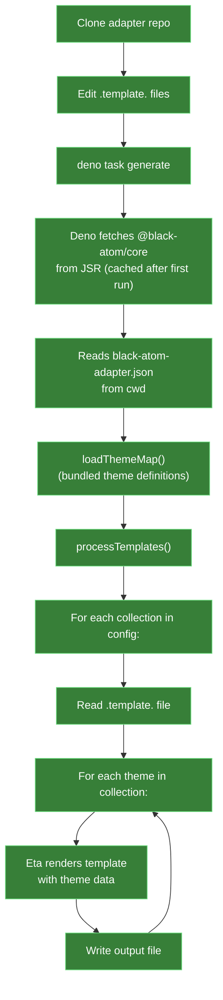
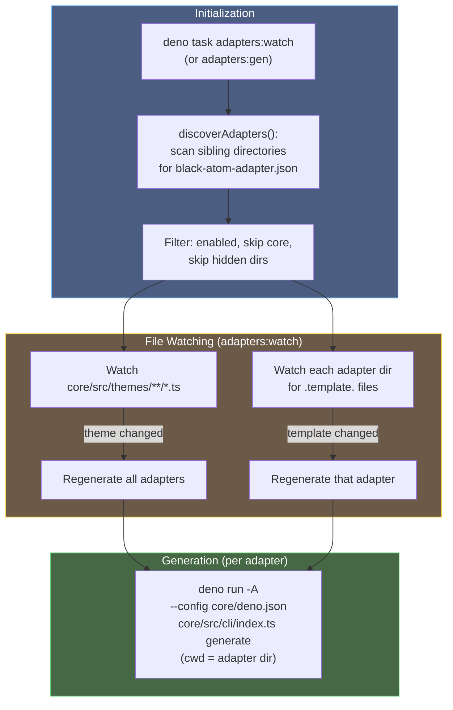

# Adapter Generation Architecture

How Black Atom Core generates theme files for adapter repositories.

## Overview

Black Atom uses an **adapter pattern**: core defines all theme colors and properties, adapter repositories transform them into platform-specific files (Neovim Lua, Ghostty config, CSS, etc.) using templates.

There are two distinct workflows:

- **Contributor workflow** — working on a single adapter, uses core via [JSR](https://jsr.io/@black-atom/core)
- **Org-owner workflow** — managing all adapters simultaneously, uses core from local source

## Contributor Workflow

Contributors work on a single adapter repository. They never need to clone core.



### Adapter `deno.json`

Each adapter repository has a `deno.json` with these tasks:

```json
{
    "tasks": {
        "generate": "deno run -A jsr:@black-atom/core/cli generate",
        "dev": "deno run -A jsr:@black-atom/core/cli generate --watch",
        "update": "deno cache --reload jsr:@black-atom/core/cli"
    }
}
```

| Task | Purpose |
|---|---|
| `generate` | One-shot theme generation from templates |
| `dev` | Watch mode — regenerates on template changes |
| `update` | Force-refresh the cached core package from JSR |

### Template Processing

Templates use [Eta](https://eta.js.org/) syntax. The output filename is derived from the template:

- `.template.` is removed from the filename
- `collection` in the path is replaced with the theme key

Example: `themes/collection.template.lua` → `themes/black-atom-jpn-koyo-yoru.lua`

Templates should reference **UI**, **syntax**, and **palette** colors — never primaries directly. This keeps adapters stable when core internals change.

---

## Org-Owner Workflow

The org-owner (running from the core repository) manages all adapters simultaneously using live source — not JSR.



### Available Tasks

| Task | Purpose |
|---|---|
| `adapters:gen` | Generate all adapters once |
| `adapters:watch` | Watch for theme/template changes, auto-regenerate |
| `adapters:status` | Show git status of all adapter repos |
| `adapters:commit` | Generate + commit all adapters |
| `adapters:push` | Push all adapter repos to remote |
| `adapters:reset` | Reset all adapter repos to remote state |

### Why Live Source?

The org-owner needs instant feedback when editing theme definitions. Using JSR would require publishing after every change. Live source (`deno run ... src/cli/index.ts`) means changes are picked up immediately.

### Directory Structure

All adapter repositories must be siblings under the same parent:

```
~/repos/black-atom-industries/
    core/           # This repository
    nvim/           # Adapter repos
    ghostty/
    tmux/
    obsidian/
    ...
```

---

## Custom Build Steps

Some adapters need more than just `generate`. The obsidian adapter, for example, assembles a single `theme.css` from generated per-theme CSS files, YAML settings, and static CSS.

**Design decision**: Core does not support build hooks. Adapters with custom build steps own their orchestration via their own `deno task build` (or similar). Core only provides `generate`.

This keeps core simple and avoids coupling adapter-specific logic into the core CLI.

---

## JSR Package

Core is published to JSR as [`@black-atom/core`](https://jsr.io/@black-atom/core).

### Exports

| Export | Entrypoint | Purpose |
|---|---|---|
| `@black-atom/core` | `src/mod.ts` | Theme types and `themeBundle` |
| `@black-atom/core/cli` | `src/cli/index.ts` | CLI for `generate` command |

### What's Included

- All theme definitions and shared components (`src/themes/`)
- CLI and supporting libraries (`src/cli/`, `src/lib/`)
- Type definitions (`src/types/`)
- Color utilities (`src/utils/`)
- Adapter config schema (`adapter.schema.json`)

### What's Excluded

- Org-owner task system (`src/tasks/`) — only needed when running from local source
- Schema generation script (`src/lib/generate-schema.ts`)
- Adapter discovery (`src/lib/discover-adapters.ts`) — only used by org-owner tasks

---

## Key Design Decisions

| Decision | Rationale |
|---|---|
| Publish to JSR, not npm | Deno-native package; JSR supports Deno first-class |
| Two exports (library + CLI) | Types/bundle for programmatic use, CLI for adapter generation |
| No build hooks in adapter config | Keeps core simple; adapters own their orchestration |
| Org-owner uses live source | Instant feedback during theme development |
| Exclude `src/tasks/` from package | Org-owner tooling only, not for contributors |
| Templates use UI/syntax/palette, never primaries | Stable adapter API even when core color internals change |
